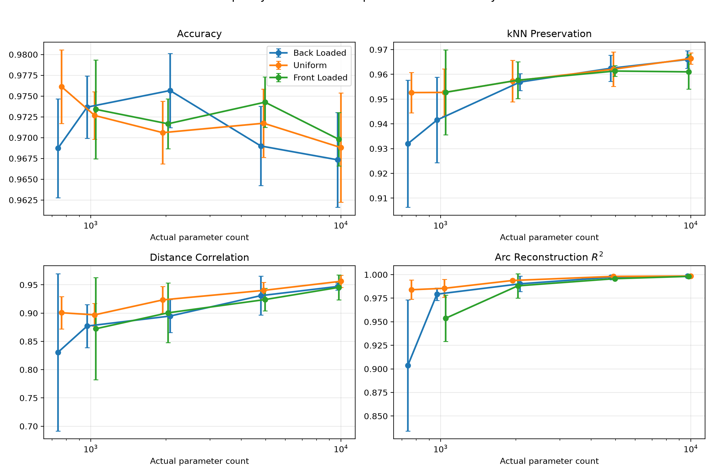

# Capacity, Not Its Arrangement, Governs How Much Geometry a Classifier Keeps

Holding the task, the data, and the total parameter budget fixed, the way
that a network's capacity is arranged across its layers has almost no
effect on how much of the geometry survives at the output. However,
the total capacity of the network plays a role in geometry preservation,
as reconstruction of the original manifold climbs as parameter budget 
increases across every arrangement, converging once the budget is no
longer scarce. The one exception to this appears to be a narrow early
layer (back-loading a small budget), which destabilises global structure 
specifically, while local structure stays robust.


## The Question

Experiment 1 showed that the task governs which geometry a classifier keeps.
This asks a different question with the task held fixed: does the architecture
matter, and if so, is it the amount of capacity or the way it is arranged?

**The guiding question of the experiment:**

_*At a fixed parameter budget, does redistributing capacity across layers 
(front-loaded, uniform, back-loaded) change how much of the input geometry the
network preserves at its output?*_


## Why Capacity Must Be Matched

Wider or deeper networks have more parameters, and more parameters mean more room
for the network to preserve geometry for purely sturtcural reasons. Any difference
in preservation could therefore be the amount of capacity, or the arrangement of
the capacity (or both). 

To break this entanglement, this experiment fixes the total parameter budget and
varies only the distribuiton of the capacity, at matched budgets.


## Setup

**Data**: A single 2-D spiral manifold, generated from a parameterised generator
and reproducible from its configuration. The spiral is used because it is the
manifold that most stresses geometry preservation. It folds near itself, so
there is real structure to lose.

**Task**: A single fixed task, 32-class arc-aligned (intrinsic) labelling. The
high-class aligned task is chosen because it is the regime where geometry
preservation is high and stable in Experiment 1, giving architecture differences
room to show.

**Model**: A three-hidden-layer perceptron. Only the hidden widths change between
conditions. The input, output, and depth are fixed.

**Capacity Allocations** (relative width templates, scaled to hit each budget):

**Front-loaded**: wide early, narrow late (e.g. 4 : 2 : 1). Capacity concentrated
near the input.

**Uniform**: equal widths (1 : 1 : 1). Capacity spread evenly.

**Back-loaded**: narrow early, wide late (e.g. 1 : 2 : 4). Capacity concentrated
near the output, forcing a narrow early layer.

Parameter budgets of 750, 1000, 2000, 5000, and 10000, each matched to within 5%.
Five seeds per condition, ten seeds for the low-budget follow-up (see Result 3).

**Metrics** (all computed at the output (logit) layer, relative to input):

**k-NN Preservation (k = 10)**: the fraction of each point's input neighbours that
remain neighbours in the representation. A measure of local geometry.

**Distance Correlation**: correlation between input and representation pairwise
distances. A measure of global geometry.

**Arc Reconstruction R²**: how well the manifold's intrinsic coordinate (arc
position) can be linearly recovered from the representation. A measure of whether
the underlying latent structure survives.


## Results

**1. Total capacity drives preservation, arrangement barely matters.**

Across all three metrics, geometric preservation rises in line with a model's
parameter budget, with the arrangements converging as the budget increases. From
roughly 2000 parameters upward, for front-loaded, back-loaded and uniformly 
distributed parameters, metrics were within a few points of each other:
k-NN ~0.96, distance correlation ~0.93-0.95, arc R² ~0.99. At a matched budget,
how the capacity is arranged has almost no effect.


**2. Under scarcity, a narrow early layer destabilises global structure specifically.**

At the lowest budget (~740 parameters), back-loading (which forces a 4-unit first layer)
separates downward from uniform architecture on global metrics: distance correlation falls 
to ~0.83 (against ~0.90 for uniform) and arc R² to ~0.90 (against ~0.98), both with large 
seed spread. A tight, early bottleneck damages the arrangement of the manifold and the
recoverability of its latent coordinate, while leaving local neighbourhoods mainly intact.



*Accuracy, k-NN preservation, distance correlation, and arc reconstruction R²
across parameter budget (log scale), for the three allocations over 5 seeds (error
bars = seed spread). Arrangements converge as capacity rises; back-loaded (blue)
separates downward on distance correlation and arc R² at the lowest budget, with a
large error bar*

**3. The low-capacity effect is a failure mode, not a consistent offset.**


Re-running low-budget back-loading over ten seeds shows the degradation is
instability and not a reliable penalty. Nine of ten seeds trained into adequate
solutions, and one failed into substantially degraded geometry (distance correlation
~0.58 against a ~0.80-0.92 cluster, arc R² ~0.87 against ~0.98). Uniform at the
same budget stays tight across seeds. So, a narrow early layer at low capacity does
not always hurt, but it occasionally fails and the failure lands on global
structure. It is noted that ten seeds is too few to estimate a failure rate.


## Caveat: not all arrangements are constructible at every budget

Front-loaded configurations cannot be built below roughly 1000 parameters within
the 5% matching tolerance as a wide initial layer exceeds the budget on its own, so
the scaling helper rejects it (recorded in the failed-architectures log). The
lowest-budget comparison is therefore back-loaded versus uniform only. This is a
structural fact about the parameter landscape, not a dropped condition: front-loading
and a tiny budget are partly incompatible by construction, which is itself
consistent with the finding that early width is the operative variable.


## What this does and does not show

**Does**. It demonstrates, at matched parameter budget on a fixed task and
manifold, that capacity arrangement has little effect on endpoint geometry while
total capacity drives it. The one exception is a narrow early layer under scarcity
destabilises global structure specifically, occasionally failing, while local
structure stays robust. Capacity is matched to within 5% (realised counts in the
results CSV). The central comparisons use 5 seeds, the low-budget instability uses
10.

**Does not**. The metrics are measured input-to-output, not layer by layer, so
this says nothing yet about where through depth the narrow early layer does its
damage. Only one task, manifold and depth are testedm these claims may not hold
up for other tasks or deeper networks.


## Next

The obvious extension is to measure geometry per layer rather than only at the
output, and in particular to trace a failed low-budget back-loaded run against a
successful one through depth.


### Reproducing

```bash
python experiments/exp2_capacity/run.py
```

Regenerates the spiral from config and reproduces the budget sweep, the low-budget
seed follow-up, and the headline figure in `outputs/`. The three stages
(`single`, `budget`, `final`) correspond to the initial single-budget look, the
full budget sweep, and the ten-seed low-budget follow-up.

_*380D33*_
